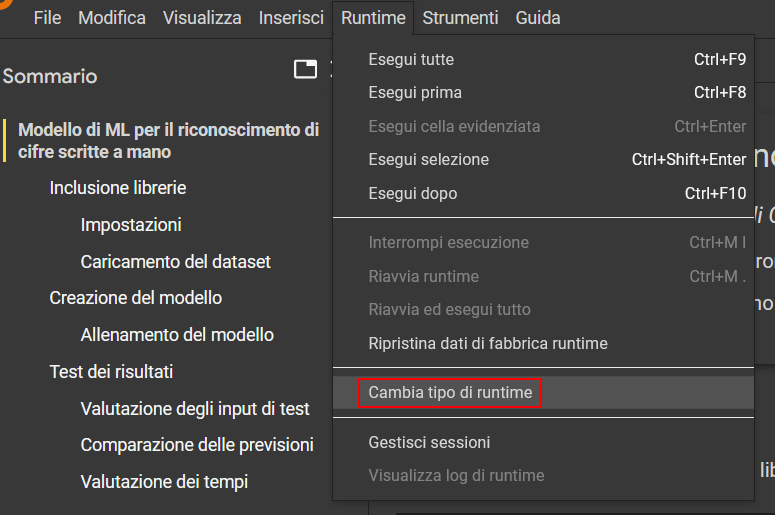
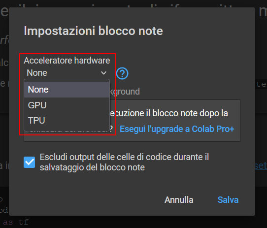
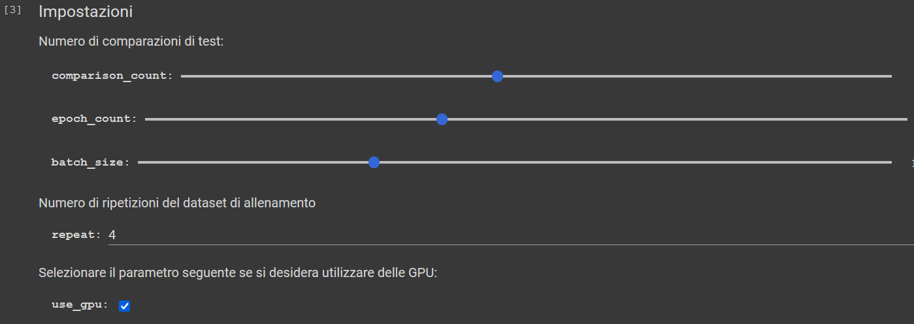
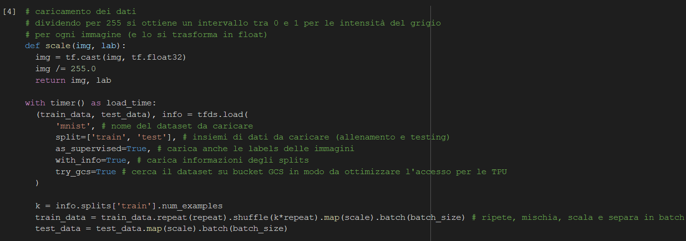
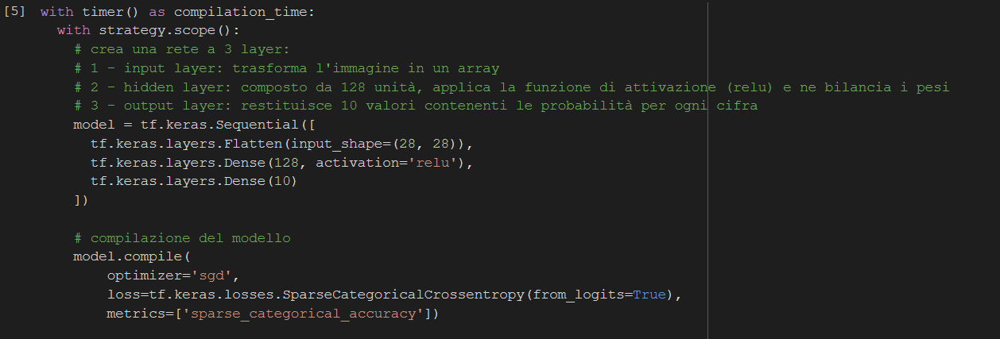
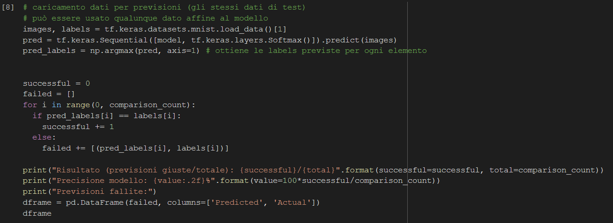
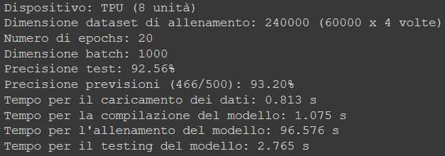

# 5 - Machine Learning e modello

## 5.1. - Machine Learning
Il **Machine Learning** (**ML**) è un sottoinsieme dell'**Intelligenza Artificiale** (**AI**), basato sull'apprendimento automatico delle informazioni di dati di diversa natura, forniti in ingresso in quantità elevate, ad un programma che esegue un algoritmo di apprendimento detto **modello**.
Ci sono tre tipi di allenamento:
1. **Apprendimento supervisionato**: il modello di ML impara dai dati in input, cambiando i coefficienti delle variabili di ingresso delle **funzioni di attivazione** delle unità costituenti la **rete neurale** (**NN**) al suo interno, in modo da minimizzare il valore di una certa **funzione di costo** (**loss function**) che esprime l'errore dell'uscita rispetto all'uscita effettiva, fornita da altri dati che costituiscono la supervisione del modello;
2. **Apprendimento non supervisionato**: il modello di ML prova ad estrarre degli schemi (**pattern**) dai dati in ingresso basandosi su correlazioni tra essi (rilevate dal modello stesso, non sono fornite altre informazioni in ingresso sulla natura dei dati);
3. **Apprendimento di rafforzamento** (**Reinforcement Learning**): il modello (anche detto *"agente"*) impara dai suoi errori una volta specificata, attraverso una **funzione ricompensa** (**reward function**) l'obiettivo desiderato (inizialmente non ci sono dati in ingresso);

Il ML si occupa quindi di sviluppare modelli efficienti e corretti nell'elaborazione e nell'apprendimento di informazioni in modo da ottenere risultati difficilmente ottenibili con algoritmi "classici" in determinate applicazioni di interesse attraverso un algoritmo in grado di automodificarsi e migliorare progressivamente.

## 5.2. - Caso di studio progetto
Il caso di studio proposto è uno dei più semplici modelli di ML (riconoscimento di immagini di cifre scritte a mano, spesso utilizzato come *"Hello World"* del ML), in quanto ritenuto sufficiente per ottenere misure del tempo di esecuzione su diverse architetture (CPU, GPU, TPU) e per compararne quindi le prestazioni.

Come prima cosa, occorre aprire il notebook contenuto nella repository in Google Colab e selezionare un runtime (Hardware Acceleration):
- **None**: CPU;
- **GPU**;
- **TPU**;

Il passo successivo è impostare i parametri richiesti:

Successivamente vengono caricati i dati:

Di seguito viene creato, allenato e testato il modello:

Infine si carica nuovamente il dataset di test e si ottengono previsioni su tale dataset dal modello che andranno ad essere confrontati con i dati reali (la cifra corretta):

Valutazione dei tempi di esecuzione:

In questo caso, si nota che la TPU ha tempi di allenamento sensibilmente inferiori rispetto a CPU e GPU (con gli stessi parametri).
La CPU completa l'allenamento nel peggior tempo (più di 2x rispetto alla TPU e circa 1.1x rispetto alla GPU).

## 5.3. -Fonti
- https://developers.google.com/machine-learning/problem-framing/cases
